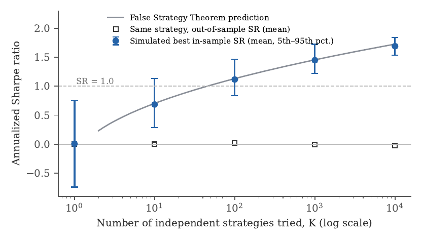
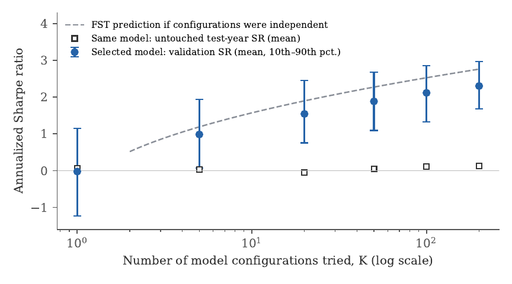
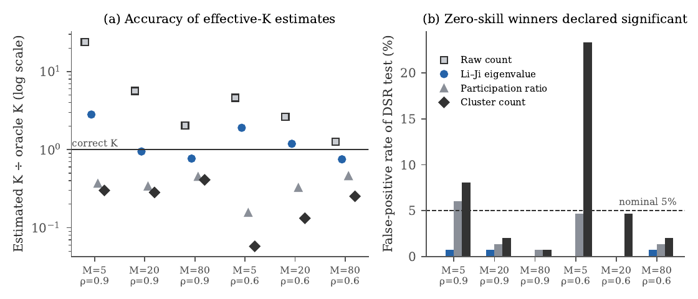
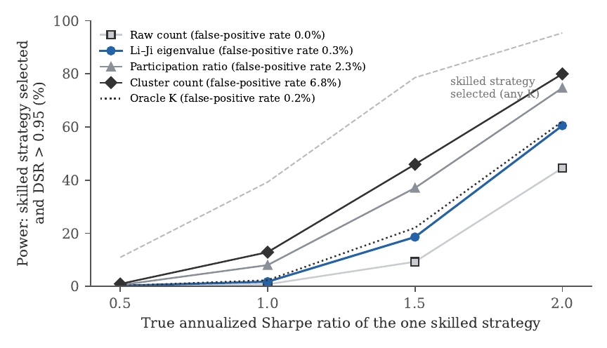
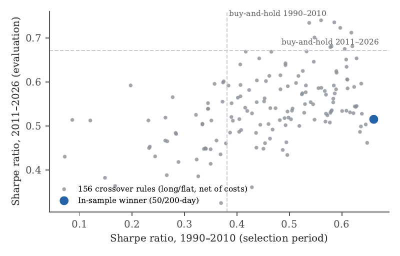

# The False Strategy Problem in Machine Learning for Finance

**Why it is dangerously easy to discover "profitable" rules that do not exist**

Navid Abdollahzadeh · Working paper, October 2026

**[Read the paper (PDF)](paper/False_Strategy_Problem_ML_Finance.pdf)**

---

## In one paragraph

If you test enough trading strategies or machine-learning models on the same historical data, the best one
will look impressive even when none of them has any real predictive power. This project measures how large
that effect is in modern ML pipelines, tests how well the standard statistical corrections remove it, and
finds a weakness in one of them. It combines seven controlled experiments, where the true answer is known,
with a case study on 36 years of S&P 500 data.

## Key findings

| # | Experiment | Result |
|---|---|---|
| 1 | Best of *K* strategies with zero true skill | The best of 1,000 five-year backtests shows an annualized Sharpe ratio of **1.45**; out of sample it earns ~0. The False Strategy Theorem predicts this within 0.04. |
| 2 | 156 moving-average rules on random walks | Best in-sample Sharpe **0.95**, out-of-sample **0.03**; probability of backtest overfitting 0.51. |
| 3 | Naive vs deflated significance | A standard test calls the lucky winner significant **100%** of the time; the Deflated Sharpe Ratio, **0%**. |
| 4 | Cross-validation leakage | Shuffled CV reports **65.7%** accuracy on an unpredictable series; purged CV gives 48.8% (chance). |
| 5 | Random search over ML models | 200 configurations of boosted trees, random forests, neural nets and logistic regression raise validation Sharpe from 0 to **2.31**; on an untouched test year: ~0. |
| 6 | GARCH, regime switching, transaction costs | Results essentially unchanged: the problem is not an artefact of Gaussian assumptions. |
| 7 | **Estimating the effective number of trials** | Counting clusters of similar strategies understates it by up to **17×** and lets **23%** of worthless strategies pass the deflated test. An eigenvalue estimator from statistical genetics (Li & Ji, 2005) keeps false positives below 1% and matches the best achievable power within 2.4 percentage points. |
| 8 | S&P 500 timing rules, 1990–2026 | The best of 156 rules (the 50/200-day "golden cross") beat buy-and-hold in 1990–2010 but trailed it in 2011–2026; its deflated significance ranged from 0.61 to 0.998 depending only on how trials were counted. |

### The best of many worthless strategies looks skilful



### ML search inflates validation performance on pure noise



### The main methodological finding: how you count trials matters





### Real data: S&P 500 timing rules



## Repository structure

```
paper/
  False_Strategy_Problem_ML_Finance.pdf   the paper
  source/                                 LaTeX source and figure files
code/
  common.py                               shared functions (Sharpe ratio, FST, PSR/DSR, PBO, effective-K estimators)
  01_simulations.py                       Experiments 1-3, minimum backtest length
  02_leakage_experiment.py                Experiment 4
  03_make_figures.py                      Figures 1-4
  04_exp5_ml_search.py                    Experiment 5
  05_exp6_realistic.py                    Experiment 6
  06_exp7_effective_k.py                  Experiment 7 (false-positive rates)
  06b_exp7_power.py                       Experiment 7 (power analysis)
  00_download_sp500.py                    downloads S&P 500 data for the case study
  07_exp8_sp500.py                        S&P 500 case study
  08_make_figures_5_8.py                  Figures 5-8
  results/                                exact result files reported in the paper
  figures/                                figure files (PDF)
assets/                                   figure images for this page
```

## Reproducing the results

```bash
pip install -r requirements.txt
cd code
python 01_simulations.py          # ~7 min
python 02_leakage_experiment.py   # ~1-2 min
python 04_exp5_ml_search.py       # ~6 min
python 05_exp6_realistic.py       # ~5 min
python 06_exp7_effective_k.py     # ~10 min
python 06b_exp7_power.py          # ~3 min
python 00_download_sp500.py       # downloads the S&P 500 data
python 07_exp8_sp500.py           # ~2 min
python 03_make_figures.py
python 08_make_figures_5_8.py
```

Times are on 2 CPU cores. All random seeds are fixed, so the synthetic experiments reproduce the paper's
numbers (tiny differences can occur across library versions). The S&P 500 price data are not included in
this repository because of the data provider's terms; `00_download_sp500.py` fetches them from Yahoo Finance.
Downloaded data can be revised over time, so the case-study numbers may differ slightly from the paper;
the exact values reported are in `code/results/exp8.json`.

Figure files vs paper numbering: `fig2.pdf` = Figure 1, `fig1.pdf` = Figure 2, `fig3`–`fig6` = Figures 3–6,
`fig8.pdf` = Figure 7 (power), `fig7.pdf` = Figure 8 (S&P 500).

## Use of AI tools

The author used the assistance of AI (Claude, by Anthropic) while preparing this paper and its code, and takes full responsibility for the content.

## Citation

If you use this work, please cite it as below (GitHub's "Cite this repository" button gives the same):

> Abdollahzadeh, N. (2026). *The False Strategy Problem in Machine Learning for Finance: Why It Is
> Dangerously Easy to Discover "Profitable" Rules That Do Not Exist*. Working paper.

## License

Code: [MIT License](LICENSE). Paper text and figures: [CC BY 4.0](https://creativecommons.org/licenses/by/4.0/).
